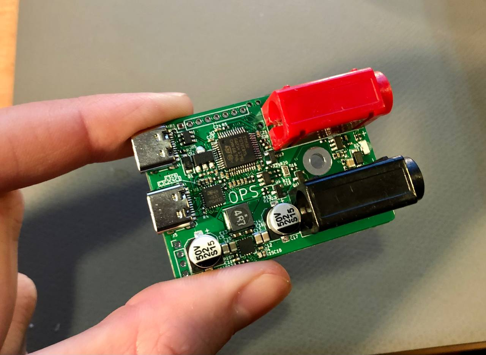

# OPS

OPS is a matchbox sized 65W CC/CV lab power supply. It is controlled by SCPI and powered by USB-PD.

**Please Note that this project is not yet fully tested.**

<table>
  <tbody>
    <tr>
      <td>
        
      </td>
    </tr>
    <tr>
      <td>
        
      </td>
      <td>
        
      </td>
    </tr>
  </tbody>
</table>
